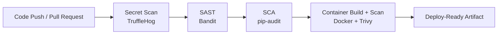

# Enterprise DevSecOps Secure Pipeline


A clean, practical DevSecOps demo project showing how to enforce security gates in CI/CD for a Python/Flask application.

## Why this repository exists

This project demonstrates how to integrate security directly into development workflows so insecure code, vulnerable dependencies, and risky container images are blocked before deployment.

## Pipeline architecture

The CI pipeline is implemented with GitHub Actions and follows an ordered, fail-fast security flow.



## Security gates

| Stage | Tool | Purpose | Fails Pipeline On |
|---|---|---|---|
| Secret scanning | TruffleHog | Detect leaked tokens/credentials | Verified secret findings |
| SAST | Bandit | Detect insecure code patterns | Actionable security findings |
| SCA | pip-audit | Detect vulnerable Python dependencies | Known unresolved vulnerabilities |
| Container security | Trivy | Scan image packages/libraries | Critical vulnerabilities (configured) |

## Project structure

```text
.
├── app/
│   ├── main.py
│   ├── routes.py
│   └── templates/
├── .github/workflows/devsecops-pipeline.yml
├── Dockerfile
├── requirements.txt
└── docs/
```

## Quick start

### Run locally

```bash
pip install -r requirements.txt
python app/main.py
```

The app will be available at: `http://localhost:5000`

### Run with Docker

```bash
docker build -t devsecops-demo-api:latest .
docker run --rm -p 5000:5000 devsecops-demo-api:latest
```

## CI workflow

Workflow file: `.github/workflows/devsecops-pipeline.yml`

Triggers:
- Push to `main`
- Pull request to `main`

Execution order:
1. Secret Scanning (TruffleHog)
2. SAST Scan (Bandit)
3. SCA Scan (pip-audit)
4. Container Scan (Trivy)

Each stage depends on the previous one and stops the pipeline on failure.

## Demo scenarios

To observe the security gates in action, introduce a controlled insecure change and push it:

> ⚠️ Use these examples only in a temporary demo branch, and remove them immediately after testing.

1. **Secret detection demo**  
   In `app/routes.py`, add a temporary line like `DEMO_API_KEY = "fake_demo_token_for_testing"` and push to trigger TruffleHog.
2. **SAST demo**  
   In `app/routes.py`, add a temporary unsafe statement such as `exec(user_input)` to trigger Bandit findings.
3. **Dependency vulnerability demo**  
   In `requirements.txt`, add `requests==2.19.0` and push to trigger pip-audit vulnerability detection.

Then remediate and re-run the pipeline to confirm a clean pass.

## Additional documentation

- [Technical Report](docs/REPORT.md)
- [Presentation Deck](docs/PRESENTATION.md)

## Tech stack

- Python 3.11
- Flask
- GitHub Actions
- TruffleHog
- Bandit
- pip-audit
- Docker
- Trivy
