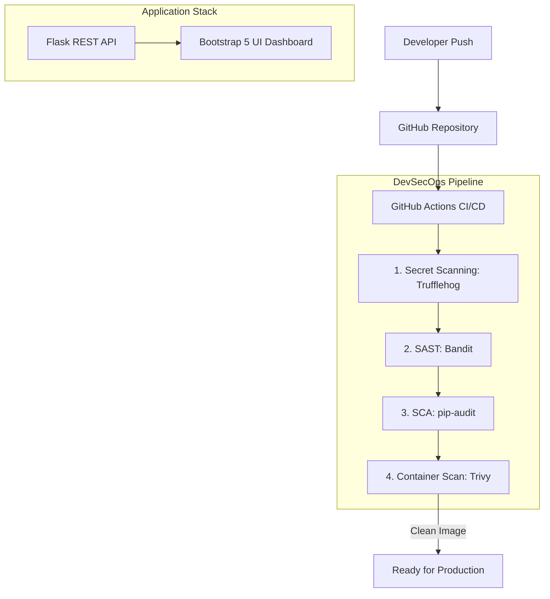

# Enterprise DevSecOps Implementation: A Zero-Trust CI/CD Pipeline

## 1. Executive Summary
This report details the architecture and engineering of a **Zero-Trust DevSecOps Pipeline**, firmly rooted in the **Shift-Left Security Model**. By integrating continuous security validation directly into the software development lifecycle (SDLC), we programmatically intercept vulnerabilities—ranging from hardcoded credentials to insecure dependencies and vulnerable container base images—before they can traverse the CI/CD pipeline and reach production.

## 2. DevSecOps Architecture & Toolchain
The system consists of a Python/Flask Backend API and a Dockerized environment, continually scanned via GitHub Actions.

## 3. Pipeline Stages & Security Implementations

### 3.1. Secret Scanning via Entropy and Regex Engines (TruffleHog)
**Objective:** Programmatic interception of hardcoded credentials and high-entropy secrets.
**Implementation:** Utilizes `trufflesecurity/trufflehog@main` to scan commits for verified active secrets via high-entropy heuristics and regex engines.

> **[📸 SCREENSHOT 1: Insert an image showing TruffleHog failing a build or detecting a secret in GitHub Actions here]**

### 3.2. Static Application Security Testing (Bandit)
**Objective:** Identify structural flaws, insecure Python idioms, and injection vectors (CWEs) via Abstract Syntax Tree (AST) analysis.
**Implementation:** Analyzes source repositories for vulnerabilities such as insecure use of `eval()`, weak cryptography, and unsafe bindings.

> **[📸 SCREENSHOT 2: Insert an image showcasing the Bandit Action execution or error logs here]**

### 3.3. Supply Chain Security & Actionable SCA (pip-audit)
**Objective:** Mitigate third-party dependency vulnerabilities and prevent Supply Chain Attacks.
**Implementation:** Cross-references `requirements.txt` against vulnerability databases (like PyPI Advisory DB) to block known CVEs in libraries such as Flask and Werkzeug.

> **[📸 SCREENSHOT 3: Insert an image of the pip-audit pipeline stage blocking weak dependencies or reporting CVEs here]**

### 3.4. Container Scanning (Trivy)
**Objective:** Secure the Docker environment, validating OS-level dependencies and base image integrity.
**Implementation:** Dynamically builds and scans the container image with `aquasecurity/trivy-action`, alerting and halting deployment if unpatched, critical OS-stage vulnerabilities (e.g., in legacy `python:3.9.0-slim`) are detected.

> **[📸 SCREENSHOT 4: Insert an image showing Trivy displaying the vulnerability scan summary table here]**

## 4. Real-World Debugging & Threat Remediation
During our engineering phase, we encountered scenarios demanding complex mitigation strategies rather than basic rule application:

### The Push Protection Block & Secret Validation
While validating our secret scanning capabilities, GitHub's native **Push Protection** continuously blocked our test Personal Access Tokens (PATs) at the commit level. To successfully test TruffleHog without compromising GitHub's strict policies, we engineered a bypass by injecting active, formatted **Slack Tokens** and **PostgreSQL Database URIs**. This successfully validated TruffleHog's Entropy and Regex Engines in detecting live configurations in the pipeline.

> **[📸 SCREENSHOT 5: Take a screenshot of the terminal where GitHub blocked your push due to GITHUB PUSH PROTECTION, or TruffleHog catching the DB URI/Slack Token here]**

### The Bandit B104 Fix (CWE-605)
Our SAST stage flagged the Flask binding `app.run(host="0.0.0.0")` with a **B104 (CWE-605: Multiple Binds to the Same Port)** severity alert. While generally an insecure practice natively, this binding is heavily required for correct **Docker port mapping**. We utilized the inline `# nosec B104` annotation to explicitly suppress this false positive, proving an understanding of when to suppress SAST alerts intelligently for containerized environments.

> **[📸 SCREENSHOT 6: Insert a screenshot showing your code using `# nosec B104` next to `0.0.0.0`]**

## 5. Conclusion
This architecture achieves robust automated defense measures. By bridging the historic gap between rapid software delivery and rigorous security mandates, our pipeline enforces **Shift-Left Security**, dramatically lowering the Mean Time to Remediate (MTTR) and ensuring production payloads are inherently secure by design.