# Enterprise DevSecOps Secure Pipeline - Technical Report

## 1. Executive Summary
This project implements a practical DevSecOps pipeline for a Python/Flask application using GitHub Actions. The objective is to integrate security directly into CI/CD so risks are detected early and insecure artifacts are blocked before deployment.

The pipeline combines secret detection, static code analysis, dependency vulnerability scanning, and container image scanning. This shift-left approach improves release confidence while preserving development speed.

---

## 2. Objectives
- Build a clean, automated secure CI pipeline for a demo-ready project.
- Detect common security risks early (code, dependencies, containers, and secrets).
- Enforce fail-fast behavior when security checks fail.
- Document the implementation in a reusable, professional format.

---

## 3. Scope
### In Scope
- GitHub Actions CI orchestration
- Secret scanning (TruffleHog)
- SAST (Bandit)
- SCA/dependency scanning (pip-audit)
- Container image build and scanning (Docker + Trivy)

### Out of Scope (Current Iteration)
- Full production CD rollout
- End-to-end runtime security stack implementation in this repository
- IaC policy enforcement (included as an architectural extension point)

---

## 4. Architecture Overview
The secure pipeline follows a gated flow from developer commit to deploy-ready artifact.

```mermaid
graph LR
    A[Developer Commit / Pull Request] --> B[GitHub Actions CI]
    B --> C[Build]
    C --> D[Test Stage]
    D --> E[SAST - Bandit]
    E --> F[SCA - pip-audit]
    F --> G[Container Build - Docker]
    G --> H[Container Scan - Trivy]
    H --> I[IaC Scan - If IaC exists]
    I --> J[Artifact / Image Registry]
    J --> K[Deploy]
    K --> L[Runtime Checks & Monitoring]
```

**Architecture screenshot placeholder**  
`[Screenshot Placeholder #1: Final architecture diagram used in presentation]`

---

## 5. Threat Model / Risk Overview
### Primary Risks Addressed
- **Hardcoded credentials** in repository history or code.
- **Insecure coding patterns** that can lead to exploitable behavior.
- **Known vulnerable dependencies** in the Python dependency tree.
- **Vulnerable OS/library packages** in container images.

### Security Strategy
- Shift-left security checks in CI.
- Fail-fast pipeline gating.
- Re-run pipeline after remediation for verification.

---

## 6. Implementation Details
### Application and Platform
- **Application:** Python/Flask API (containerized)
- **CI/CD Orchestrator:** GitHub Actions
- **Containerization:** Docker

### Workflow Design
Jobs run in a staged order to enforce dependency and security gates:
1. Secret Scan
2. SAST
3. SCA
4. Container Build + Container Scan

If a gate fails, downstream jobs are blocked.

---

## 7. Pipeline Stages and Tooling
| Stage | Tool | Purpose | Gate Outcome |
|---|---|---|---|
| Secret Scan | TruffleHog | Detect hardcoded secrets and leaked credentials | Fail pipeline on verified findings |
| SAST | Bandit | Analyze Python code for insecure patterns | Fail pipeline on actionable issues |
| SCA | pip-audit | Detect known vulnerable dependencies | Fail pipeline on unresolved vulnerabilities |
| Container Scan | Trivy | Scan image OS/libs for high-risk CVEs | Fail pipeline on configured severity threshold |

---

## 8. Key Security Controls
- **Automated CI security gates** before deploy-ready artifacts.
- **Fail-fast policy** to stop vulnerable changes early.
- **Dependency risk visibility** with actionable scanner output.
- **Container hardening feedback loop** for image selection and patching.

---

## 9. Results and Metrics (Demo-Oriented)
This repository is designed as a demonstration of secure pipeline behavior.

### Qualitative Results
- Security checks are integrated directly into developer workflow.
- Pipeline provides rapid feedback on security posture per change.
- Demonstrates security as a team-wide engineering responsibility.

### Metrics Placeholders (fill with your run data)
- Pipeline success rate: `[XX%]`
- Average pipeline duration: `[XX min]`
- Security issues detected in demo runs: `[N]`
- Mean time to remediate (demo): `[XX hours/minutes]`

**Evidence placeholders**
- `[Screenshot Placeholder #2: GitHub Actions run with all security jobs]`
- `[Screenshot Placeholder #3: TruffleHog output excerpt]`
- `[Screenshot Placeholder #4: Bandit findings/remediation example]`
- `[Screenshot Placeholder #5: pip-audit findings/remediation example]`
- `[Screenshot Placeholder #6: Trivy scan summary]`

---

## 10. How to Reproduce
1. Clone the repository.
2. Open the workflow file to review stage order and gate logic.
3. Push a change or open a pull request to trigger CI.
4. Review each job result in GitHub Actions.
5. (Optional for demo) Introduce a controlled security issue and observe fail-fast behavior.
6. Remediate and re-run pipeline to confirm resolution.

**Reproduction screenshot placeholder**  
`[Screenshot Placeholder #7: Workflow trigger and run history]`

---

## 11. Limitations
- Runtime monitoring and post-deploy controls are represented architecturally, not fully implemented in this repository.
- IaC scanning is shown as a recommended stage for projects with Terraform/Kubernetes manifests.
- Current report uses demo placeholders instead of production KPI datasets.

---

## 12. Future Work
- Add IaC scanning when infrastructure manifests are introduced.
- Add DAST/API security testing stage for pre-release environments.
- Add signed artifact attestations and provenance verification.
- Add centralized runtime telemetry and alert correlation.

---

## 13. Conclusion
This project demonstrates a practical DevSecOps implementation where security is embedded into CI/CD as a default engineering behavior. By combining culture, automation, and staged controls, the pipeline reduces risk early, improves delivery confidence, and provides a strong foundation for secure software delivery at scale.

---

## 14. LinkedIn Post Draft (Optional)
Built and demonstrated an **Enterprise DevSecOps Secure Pipeline** using GitHub Actions, TruffleHog, Bandit, pip-audit, Docker, and Trivy.

Key outcome: security is now integrated directly into CI/CD with fail-fast quality gates, enabling faster and safer delivery.

#DevSecOps #CyberSecurity #CloudSecurity #AppSec #ShiftLeft #GitHubActions #Docker #Python
