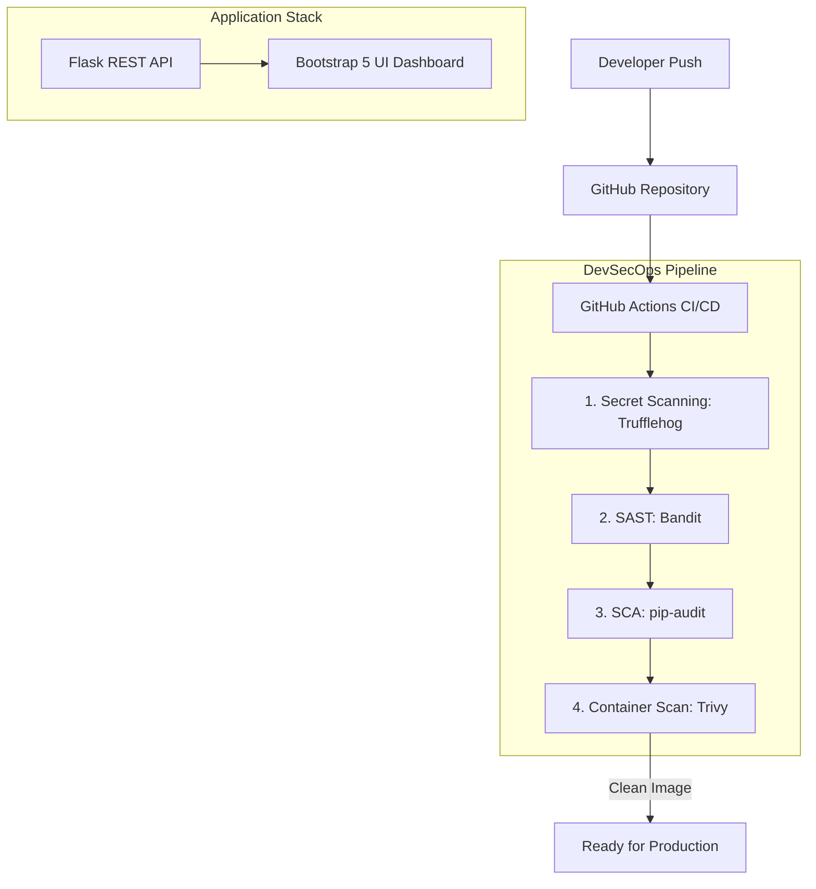

# DevSecOps Project Report

## 1. Executive Summary
This project demonstrates a fully functional "Shift-Left" DevSecOps CI/CD pipeline. By integrating security checkpoints directly into the software development lifecycle, we catch vulnerabilities—such as exposed secrets, bad coding practices, insecure libraries, and vulnerable OS configurations—before they reach production.

## 2. Project Architecture
The system consists of a Python/Flask Backend API and a Dockerized environment, continually scanned via GitHub Actions.

## 3. Pipeline Stages Explained

### 3.1. Secret Scanning (TruffleHog)
**Objective:** Intercept hardcoded credentials.
**Mechanism:** Uses `trufflesecurity/trufflehog@main` to scan commits for verified secrets, ensuring AWS keys, Github Tokens, and Stripe keys are not leaked.

### 3.2. Static Application Security Testing (Bandit)
**Objective:** Identify insecure python code implementation.
**Mechanism:** Analyzes `.py` files. Flags functions like `eval()`, `exec()`, hardcoded passwords, or binding to `0.0.0.0` securely using `# nosec` annotations.

### 3.3. Software Composition Analysis (pip-audit)
**Objective:** Block known CVEs in third-party libraries.
**Mechanism:** Checks `requirements.txt`. Found severe CVEs in Flask & Werkzeug `3.0.x` and ensured an upgrade to `3.1.x` secure components.

### 3.4. Container Scanning (Trivy)
**Objective:** Secure the Docker environment and OS-level dependencies.
**Mechanism:** Builds the container and runs `aquasecurity/trivy-action`. Throws an alarm if the base image (like `python:3.9.0-slim`) contains critical, unpatched OS-stage vulnerabilities.

## 4. Demonstration Scenarios
During our testing phase, we successfully demonstrated both the **red** and **green** states for each tool:
- **Red State:** Pushed active fake keys, `eval()` vulnerabilities, and severely outdated Docker base images (`python:3.9.0-slim`). The pipeline correctly blocked the code from being shipped (Exit Code 1).
- **Green State:** Applied dependency upgrades, removed secrets, and annotated intentional/safe exceptions (`# nosec B104`). The pipeline succeeded across all 4 stages.

## 5. Conclusion
This architecture achieves a robust automated defense measure. By halting deployments when security flaws are discovered, the DevSecOps model bridges the historic gap between rapid software delivery and rigorous security mandates.